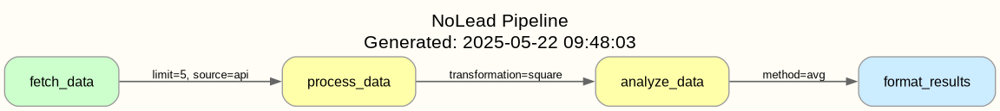
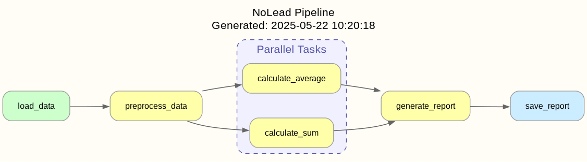

<p align="center">
  
</p>

# nolead

[](https://github.com/ruivieira/nolead/actions/workflows/python-tests.yml)

A lightweight pipeline orchestration library.

## Features

- Simple task annotation with `@Task()` decorator
- Automatic dependency resolution with `uses()` function
- Clean task completion with `done()` function
- Single entry point to run entire pipelines with `run_task()`
- Parameter passing between tasks, similar to Luigi
- Task dependency visualization with parameter information

## Installation

```bash
pip install .
```

## Quick Example

```python
from nolead import Task, run_task, uses, done

@Task()
def fetch_data():
    print("Fetching data...")
    return [1, 2, 3, 4, 5]

@Task()
def process_data():
    print("Processing data...")
    # Get result from the dependent task
    data = uses(fetch_data)
    # Process the data
    processed_data = [x * 2 for x in data]
    return done(processed_data)

@Task()
def save_results():
    print("Saving results...")
    # Get result from the dependent task
    processed_data = uses(process_data)
    # Save the results
    print(f"Results saved: {processed_data}")
    return done(True)

if __name__ == "__main__":
    # Execute the pipeline by running the final task
    result = run_task(save_results)
    print(f"Pipeline completed with result: {result}")
```

## Advanced Usage

### Named Tasks

You can use named tasks:

```python
@Task(name="fetch_users")
def fetch_users():
    # ... implementation ...
    return users

# Later, refer to the task by name
users = uses("fetch_users")
```

### Parameter Passing

Tasks can accept parameters, which can be passed in several ways:

1. **Default parameters in function definitions**:
```python
@Task(name="process_data")
def process_data(batch_size=100, validate=False):
    # Use parameters in task logic
    print(f"Processing with batch size {batch_size}")
    # ...
```

2. **Pass parameters when calling `uses()`**:
```python
@Task(name="generate_report")
def generate_report():
    # Pass parameters to upstream task
    data = uses("process_data", batch_size=200, validate=True)
    # ...
```

3. **Pass parameters when running a task directly**:
```python
# Run with custom parameters
result = run_task("process_data", batch_size=500, validate=True)
```

Parameters are passed down to the task function and cached based on their values. Each unique combination of a task and parameters is cached separately.

Check out the `examples/parameter_example.py` file for more detailed examples of parameter passing.

### Pipeline Visualization

NoLead supports visualization of task dependencies, including the parameters passed between tasks:

```python
from nolead import generate_dependency_graph

# Generate a DOT file for the entire pipeline
generate_dependency_graph("pipeline.dot", output_format="dot")

# Generate a text representation of the dependencies
generate_dependency_graph("pipeline.txt", output_format="text")
```

#### Graphical Visualization

To render the DOT file as an image, you can use Graphviz:

```bash
dot -Tpng pipeline.dot -o pipeline.png
```

For example, this pipeline with parameters:

```python
@Task(name="fetch_data")
def fetch_data(source="database", limit=10):
    # ... implementation ...
    return data

@Task(name="process_data")
def process_data(transformation="double"):
    # Pass specific parameters to the upstream task
    data = uses("fetch_data", source="api", limit=5)
    # ... implementation ...
    return done(result)

@Task(name="analyze_data")
def analyze_data(method="sum"):
    # Pass specific parameters to the upstream task
    data = uses("process_data", transformation="square")
    # ... implementation ...
    return done(result)

@Task(name="format_results")
def format_results(format_type="text"):
    # Pass specific parameters to the upstream task
    value = uses("analyze_data", method="avg")
    # ... implementation ...
    return done(result)
```

When visualized with Graphviz, shows the parameters passed between tasks:



### Parallel Task Execution

NoLead supports running multiple tasks in parallel and visualizing parallel task groups in the pipeline graph.

```python
from nolead import Task, uses, parallel, run_task

@Task()
def fetch_data():
    # ... implementation ...
    return data

@Task()
def process_data():
    raw_data = uses(fetch_data)
    # ... implementation ...
    return processed_data

@Task()
def calculate_sum():
    data = uses(process_data)
    # ... implementation ...
    return {"sum": sum(data)}

@Task()
def calculate_average():
    data = uses(process_data)
    # ... implementation ...
    return {"average": sum(data) / len(data)}

@Task()
def generate_report():
    # Run calculations in parallel
    results = parallel([calculate_sum, calculate_average])

    # Access results from each parallel task
    sum_result = results["calculate_sum"]["sum"]
    avg_result = results["calculate_average"]["average"]

    return {"summary": f"Sum: {sum_result}, Average: {avg_result}"}
```

#### Parallel Task Visualization

Parallel tasks are visualized with special styling in the dependency graph:

1. In DOT format (Graphviz):
   - Parallel tasks are grouped in a subgraph with a dashed border
   - Edges connecting to parallel task groups have a dashed, bold style

2. In text format:
   - Parallel tasks are listed as a separate section
   - Tasks that are part of parallel groups are marked with `[parallel]`

Example of a pipeline with parallel tasks visualized with Graphviz:



The visualization clearly shows which tasks are executed in parallel (calculate_sum and calculate_average), making the pipeline structure easier to understand.

#### Parallel Task Result Format

When using `parallel()`, the results are returned as a dictionary where:
- Keys are the task names
- Values are the return values from each task

```python
results = parallel([task1, task2])
# Results will be:
# {
#   "task1": {"result": "data from task1"},
#   "task2": {"result": "data from task2"}
# }
```

For more detailed information on parallel task execution, see [the parallel tasks documentation](docs/parallel_tasks.md) and [our detailed example](docs/parallel_tasks_example.md).

#### Text-Based Visualization

Alternatively, you can use the text-based visualization:

```
Pipeline Dependency Graph
========================

Parallel Task Groups:
  Group 1: calculate_average, calculate_sum

Task: calculate_average
  Dependencies:
    - process_data

Task: calculate_sum
  Dependencies:
    - process_data

Task: fetch_data
  Dependencies: None

Task: generate_report
  Dependencies:
    - calculate_average [parallel]
    - calculate_sum [parallel]

Task: process_data
  Dependencies:
    - fetch_data
```

## Development

This project uses several development tools to ensure code quality:

- **Ruff**: For linting and code formatting
- **Mypy**: For static type checking
- **Pytest**: For unit testing

### Development Setup

```bash
# Install development dependencies
make deps
```

### Running Tests and Checks

```bash
# Run all checks (lint, type check, tests)
make all

# Run individual checks
make lint    # Run linting
make check   # Run type checking
make test    # Run unit tests

# Clean up project
make clean
```

## License

Apache 2.0 License
