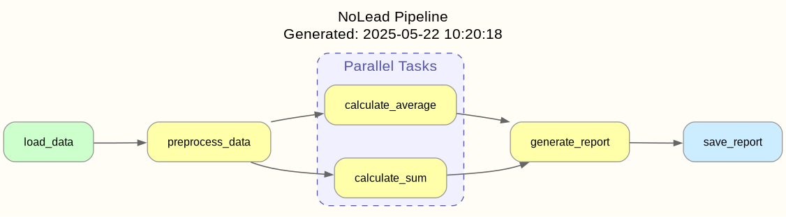

# Parallel Task Execution Example

This example demonstrates how to use the parallel task execution feature in NoLead, including visualization of the task dependencies.

## The Pipeline

The following pipeline performs these steps:
1. Load raw data
2. Preprocess the data
3. Perform two calculations in parallel:
   - Calculate the sum of the data
   - Calculate the average of the data
4. Generate a report combining the results
5. Save the report

```python
import time
import os
from nolead import Task, uses, done, parallel, generate_dependency_graph, run_task


# Define tasks for our pipeline
@Task()
def load_data():
    """Load raw data for processing."""
    print("Loading data...")
    time.sleep(1)  # Simulate work
    return {"raw_data": [1, 2, 3, 4, 5, 6, 7, 8, 9, 10]}


@Task()
def preprocess_data():
    """Preprocess the data before analysis."""
    data = uses(load_data)
    print("Preprocessing data...")
    time.sleep(1)  # Simulate work
    return {"preprocessed_data": [x * 2 for x in data["raw_data"]]}


@Task()
def calculate_sum():
    """Calculate the sum of preprocessed data."""
    data = uses(preprocess_data)
    print("Calculating sum...")
    time.sleep(2)  # Simulate work
    return {"sum": sum(data["preprocessed_data"])}


@Task()
def calculate_average():
    """Calculate the average of preprocessed data."""
    data = uses(preprocess_data)
    print("Calculating average...")
    time.sleep(2)  # Simulate work
    values = data["preprocessed_data"]
    return {"average": sum(values) / len(values)}


@Task()
def generate_report():
    """Generate a final report by combining the parallel calculation results."""
    # Run the calculations in parallel and get the combined results
    results = parallel([calculate_sum, calculate_average])

    print("Generating report...")
    time.sleep(1)  # Simulate work

    # Create a report from the parallel task results
    report = {
        "sum": results["calculate_sum"]["sum"],
        "average": results["calculate_average"]["average"],
        "timestamp": time.time()
    }

    print("\nFinal Report:")
    print(f"Sum: {report['sum']}")
    print(f"Average: {report['average']}")

    return report


@Task()
def save_report():
    """Save the report to a file."""
    report = uses(generate_report)
    print("Saving report to file...")
    time.sleep(1)  # Simulate work

    # In a real application, we would save to a file here
    print(f"Report saved with timestamp: {report['timestamp']}")
    return {"status": "success"}


def main():
    """Run the example pipeline and generate a visualization."""
    print("Starting pipeline with parallel tasks...\n")

    # Run the pipeline
    start_time = time.time()
    result = run_task(save_report)
    end_time = time.time()

    print(f"\nPipeline completed in {end_time - start_time:.2f} seconds")
    print(f"Result: {result}")

    # Generate visualizations
    os.makedirs("output", exist_ok=True)
    dot_file = generate_dependency_graph("output/parallel_pipeline.dot")
    text_file = generate_dependency_graph("output/parallel_pipeline.txt", output_format="text")

    print(f"\nVisualization generated at:")
    print(f"- DOT file: {dot_file}")
    print(f"- Text file: {text_file}")
    print("\nTo convert the DOT file to an image, run:")
    print("  dot -Tpng output/parallel_pipeline.dot -o output/parallel_pipeline.png")


if __name__ == "__main__":
    main()
```

## Key Points

1. The `parallel()` function takes a list of tasks to execute concurrently:
   ```python
   results = parallel([calculate_sum, calculate_average])
   ```

2. Results are returned as a dictionary with task names as keys:
   ```python
   sum_result = results["calculate_sum"]["sum"]
   avg_result = results["calculate_average"]["average"]
   ```

3. Dependencies are automatically tracked - both `calculate_sum` and `calculate_average` depend on `preprocess_data`, which runs first.

## Visualization

### Graphical (DOT) Format

When visualized with Graphviz, parallel tasks are shown in a subgraph with a dashed border:



Note how:
- The parallel tasks (`calculate_sum` and `calculate_average`) are grouped in a dashed box
- The edges from these tasks to `generate_report` are styled with dashed, bold lines
- The dependency relationships are preserved, with both parallel tasks depending on `preprocess_data`

### Text Format

The text visualization clearly marks parallel tasks:

```
Pipeline Dependency Graph
========================

Parallel Task Groups:
  Group 1: calculate_sum, calculate_average

Task: calculate_average
  Dependencies:
    - preprocess_data

Task: calculate_sum
  Dependencies:
    - preprocess_data

Task: generate_report
  Dependencies:
    - calculate_average [parallel]
    - calculate_sum [parallel]

Task: load_data
  Dependencies: None

Task: preprocess_data
  Dependencies:
    - load_data

Task: save_report
  Dependencies:
    - generate_report
```

## Performance Benefits

By running tasks in parallel, you can significantly reduce the total execution time of your pipeline when you have multiple independent tasks that can be executed concurrently.

In this example, if we ran `calculate_sum` and `calculate_average` sequentially, it would take around 4 seconds (2 seconds each). With parallel execution, it takes only about 2 seconds, as they run concurrently.
